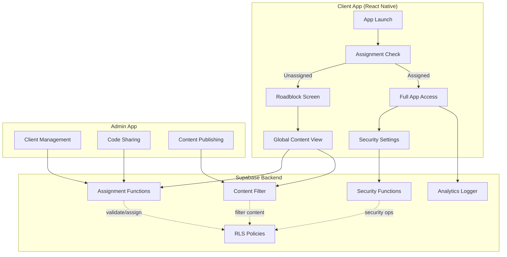
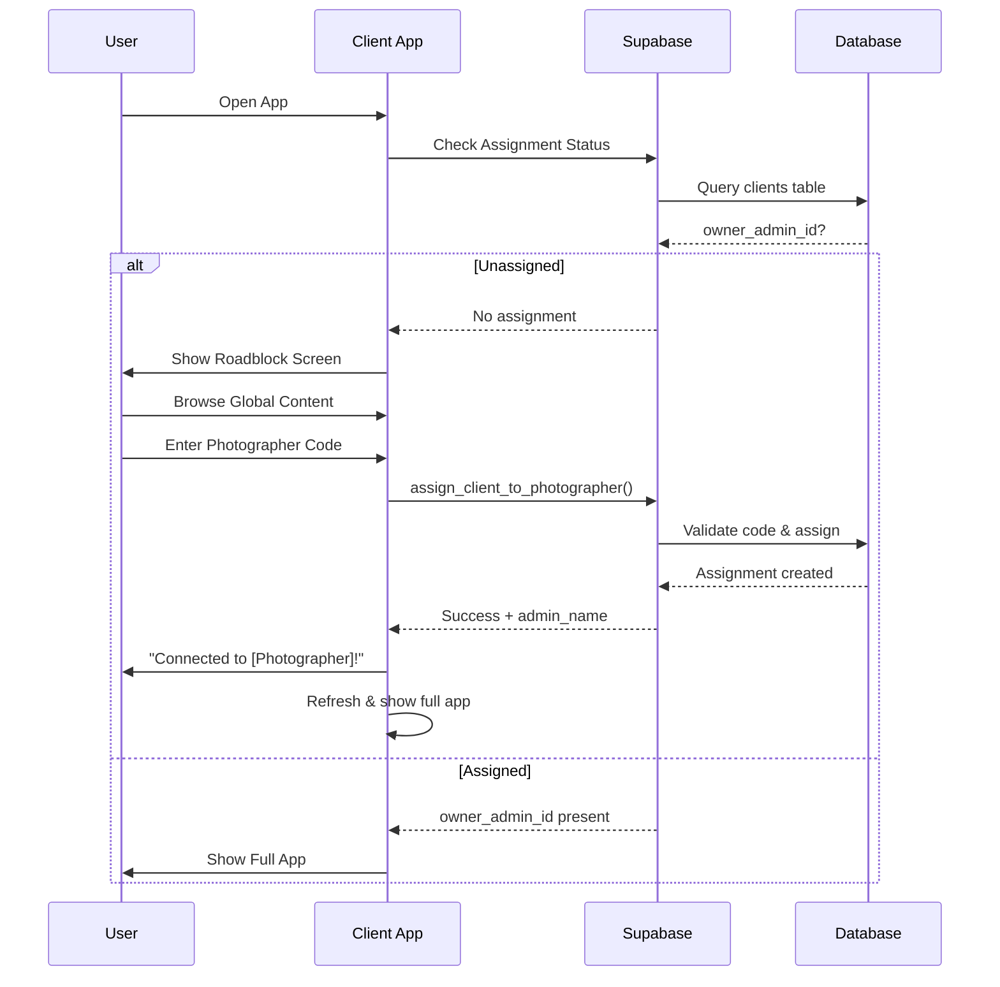
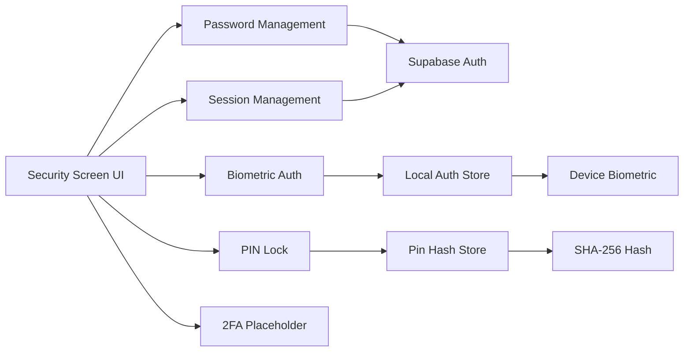

# Technical Design Document: Unassigned Users and Security Features

## Overview

This design document specifies the technical implementation for:
1. **Unassigned user discovery and assignment flow** - Allowing new users to browse global content while blocking private features until photographer assignment
2. **Photographer code assignment system** - Multiple assignment methods (manual code entry, QR scan, invite links)
3. **Admin-initiated client creation** - Photographers can create client records that auto-assign on user login
4. **Security feature backend integration** - Full implementation of password management, biometric auth, PIN lock, and session control
5. **Database migration fixes** - Corrections for payment status enums and revenue pipeline view
6. **Content visibility controls** - Fine-grained visibility settings for BTS and announcements
7. **Analytics tracking** - Metrics for unassigned user behavior and conversion

The system builds upon existing database infrastructure (user_profiles, clients, photographer_code) and extends it with complete frontend-backend integration for both assignment workflows and security features.

## Architecture

### High-Level Architecture



### Assignment Flow Architecture



### Security Features Architecture



## Components and Interfaces

### 1. Unassigned User Flow Components


#### RoadblockScreen Component

**Location:** `split-apps/user-app/app/roadblock.tsx`

**Purpose:** Display to unassigned users blocking private features while allowing global content access

**Props:**
```typescript
interface RoadblockScreenProps {
  onEnterCode: () => void;
  onSkip: () => void;
}
```

**State:**
- `globalContent: { bts: BTSPost[], announcements: Announcement[] }`
- `loading: boolean`

**Key Features:**
- Hero section with illustration and call-to-action
- Prominent "Enter Photographer Code" button
- Preview cards of global BTS posts and announcements
- "Skip" button to browse without assignment
- Smooth animation transitions

**API Calls:**
- `GET /rest/v1/bts_posts?visibility=eq.global&select=*`
- `GET /rest/v1/announcements?visibility=eq.global&select=*`

#### CodeEntryModal Component

**Location:** `split-apps/user-app/components/CodeEntryModal.tsx`

**Purpose:** Modal for entering photographer codes with validation

**Props:**
```typescript
interface CodeEntryModalProps {
  visible: boolean;
  onClose: () => void;
  onSuccess: (adminName: string) => void;
}
```

**State:**
- `code: string` (8 characters, auto-uppercase)
- `loading: boolean`
- `error: string | null`

**Validation:**
- Length: exactly 8 characters
- Format: alphanumeric only
- Real-time uppercase conversion

**API Calls:**
- `POST /rest/v1/rpc/assign_client_to_photographer` with `{ p_client_id, p_photographer_code }`

**Error Handling:**
- Invalid code: "Invalid photographer code. Please check with your photographer."
- Already assigned: "You are already assigned to [Current Photographer]. Contact support to change photographers."
- Network error: "Connection lost. Please check your internet and try again."

#### QRCodeScanner Component

**Location:** `split-apps/user-app/components/QRCodeScanner.tsx`

**Purpose:** Scan photographer QR codes for instant assignment

**Props:**
```typescript
interface QRCodeScannerProps {
  visible: boolean;
  onClose: () => void;
  onCodeScanned: (code: string) => void;
}
```

**Implementation:**
- Uses `expo-camera` for QR scanning
- Requests camera permissions
- Validates scanned data format
- Extracts photographer code from QR payload
- Calls `assign_client_to_photographer` with `assigned_via='qr_scan'`

### 2. Assignment Status Hook

**Location:** `split-apps/user-app/hooks/useAssignmentStatus.ts`

**Purpose:** Centralized hook for checking and managing assignment status

```typescript
interface AssignmentStatus {
  isAssigned: boolean;
  photographerId: UUID | null;
  photographerName: string | null;
  clientId: UUID | null;
  loading: boolean;
  refresh: () => Promise<void>;
}

export function useAssignmentStatus(): AssignmentStatus {
  // Implementation
}
```


**Behavior:**
- Fetches assignment status from clients table on mount
- Caches result in memory for session
- Provides refresh function for manual updates
- Subscribes to real-time changes on clients table
- Returns loading state during fetch

**Query:**
```sql
SELECT 
  c.id as client_id,
  c.owner_admin_id as photographer_id,
  up.name as photographer_name
FROM clients c
LEFT JOIN user_profiles up ON up.id = c.owner_admin_id
WHERE c.user_id = $1
LIMIT 1;
```

### 3. Admin Client Management Components

#### CreateClientForm Component

**Location:** `split-apps/admin-app/components/CreateClientForm.tsx`

**Purpose:** Admin interface for creating client records with auto-assignment

**Props:**
```typescript
interface CreateClientFormProps {
  onSuccess: (clientId: UUID) => void;
  onCancel: () => void;
}
```

**Fields:**
- `name: string` (required)
- `mobile_number: string` (required, E.164 format)
- `email: string` (optional)
- `notes: string` (optional, textarea)

**Validation:**
- Name: minimum 2 characters
- Mobile: E.164 format validation (e.g., +254712345678)
- Email: RFC 5322 format if provided
- Duplicate mobile check before submission

**API Calls:**
- `POST /rest/v1/clients` with owner_admin_id = current admin
- `POST /rest/v1/rpc/send_client_invite_sms` after creation

**SMS Message Template:**
```
You've been added by [Photographer Name]. Download the [App Name] app and login with this number to access your photos.
[App Store Link]
```

#### PhotographerCodeDisplay Component

**Location:** `split-apps/admin-app/components/PhotographerCodeDisplay.tsx`

**Purpose:** Display and share photographer code

**Features:**
- Large, prominent code display
- Copy to clipboard button with haptic feedback
- Share button opening native share sheet
- QR code generation and display
- Code regeneration option with confirmation dialog

**Props:**
```typescript
interface PhotographerCodeDisplayProps {
  code: string;
  photographerName: string;
  onRegenerate: () => Promise<void>;
}
```

**Share Sheet Message:**
```
Use code [PHOTOGRAPHER_CODE] to access your photos in the [App Name] app. 
Download: [App Store Link]
```

### 4. Security Feature Components

#### SecurityScreen Component

**Location:** `split-apps/user-app/app/(tabs)/profile/security.tsx`

**Purpose:** Main security settings screen

**Sections:**
1. Password Management
2. Biometric Authentication
3. PIN Lock
4. Session Management
5. Two-Factor Authentication (placeholder)

**State:**
```typescript
interface SecurityState {
  biometricEnabled: boolean;
  pinEnabled: boolean;
  has2FA: boolean;
  passwordLastChanged: Date | null;
}
```


**API Integration:**
- `GET /rest/v1/user_profiles?id=eq.$userId&select=biometric_enabled,pin_hash,password_changed_at,2fa_enabled`
- Various security-specific RPC calls (detailed below)

#### PasswordChangeModal Component

**Location:** `split-apps/user-app/components/PasswordChangeModal.tsx`

**Props:**
```typescript
interface PasswordChangeModalProps {
  visible: boolean;
  onClose: () => void;
  onSuccess: () => void;
}
```

**Fields:**
- Current password (secure entry)
- New password (secure entry)
- Confirm password (secure entry)

**Validation Rules:**
- Current password verification via Supabase auth
- New password minimum 8 characters
- At least one uppercase letter
- At least one number
- Passwords match

**API Calls:**
- `supabase.auth.signInWithPassword()` to verify current password
- `supabase.auth.updateUser({ password: newPassword })` to update

**Audit Logging:**
- Logs password change event to `admin_audit_log` table

#### BiometricToggle Component

**Location:** `split-apps/user-app/components/BiometricToggle.tsx`

**Purpose:** Enable/disable biometric authentication

**Implementation:**
```typescript
import * as LocalAuthentication from 'expo-local-authentication';

async function enableBiometric() {
  // Check hardware availability
  const hasHardware = await LocalAuthentication.hasHardwareAsync();
  if (!hasHardware) {
    throw new Error('Biometrics not supported on this device');
  }
  
  // Authenticate to confirm
  const result = await LocalAuthentication.authenticateAsync({
    promptMessage: 'Verify your identity',
    cancelLabel: 'Cancel',
  });
  
  if (!result.success) {
    throw new Error('Biometric authentication failed');
  }
  
  // Update database
  await supabase
    .from('user_profiles')
    .update({ biometric_enabled: true })
    .eq('id', userId);
}
```

**Fallback Strategy:**
- After 3 failed biometric attempts, fall back to password
- Store failed attempt count in secure storage
- Reset count on successful authentication

#### PINLockModal Component

**Location:** `split-apps/user-app/components/PINLockModal.tsx`

**Purpose:** Create, verify, and manage 6-digit PIN

**States:**
- `CREATE_PIN`: Initial PIN setup
- `CONFIRM_PIN`: Confirm PIN by re-entry
- `VERIFY_PIN`: Verify existing PIN
- `CHANGE_PIN`: Change existing PIN

**UI:**
- Large numeric keypad (0-9)
- Masked PIN display (••••••)
- Clear/backspace button
- Visual feedback on entry

**Security:**
- Hash PIN with SHA-256 before storage
- Store hash in `user_profiles.pin_hash`
- 3 attempt limit before lockout
- Lockout requires password or biometric to reset

**Implementation:**
```typescript
import { SHA256 } from 'crypto-js';

function hashPIN(pin: string): string {
  return SHA256(pin).toString();
}

async function verifyPIN(enteredPIN: string): Promise<boolean> {
  const hash = hashPIN(enteredPIN);
  const { data } = await supabase
    .from('user_profiles')
    .select('pin_hash')
    .eq('id', userId)
    .single();
  
  return data?.pin_hash === hash;
}
```

#### SessionManagement Component

**Location:** `split-apps/user-app/components/SessionManagement.tsx`

**Purpose:** Display and manage active sessions

**Features:**
- "Sign out of all devices" button
- Confirmation dialog before global sign out
- Haptic feedback on action
- Navigation to login screen after sign out
- Audit log entry

**Implementation:**
```typescript
async function signOutAllDevices() {
  const confirmed = await showConfirmation(
    'Sign out of all devices?',
    'You will need to login again on all devices.'
  );
  
  if (!confirmed) return;
  
  await supabase.auth.signOut({ scope: 'global' });
  
  // Clear local state
  await AsyncStorage.clear();
  
  // Log event
  await supabase.from('admin_audit_log').insert({
    admin_id: userId,
    action: 'global_signout',
    description: 'User signed out of all devices',
  });
  
  // Navigate to login
  router.replace('/login');
}
```

### 5. App Launch Guard Component

**Location:** `split-apps/user-app/app/_layout.tsx` (root layout)

**Purpose:** Check biometric/PIN on app launch

**Flow:**
```typescript
useEffect(() => {
  async function checkSecurityOnLaunch() {
    const profile = await getSecurityProfile();
    
    if (profile.biometric_enabled) {
      const authenticated = await authenticateBiometric();
      if (!authenticated) {
        // Fall back to password after 3 attempts
        showPasswordPrompt();
      }
    } else if (profile.pin_hash) {
      const authenticated = await authenticatePIN();
      if (!authenticated) {
        // Fall back to password after 3 attempts
        showPasswordPrompt();
      }
    }
    
    // Allow app access
    setSecurityPassed(true);
  }
  
  checkSecurityOnLaunch();
}, []);
```

## Data Models

### Database Schema Extensions

#### user_profiles table updates


```sql
ALTER TABLE user_profiles ADD COLUMN IF NOT EXISTS biometric_enabled BOOLEAN DEFAULT false;
ALTER TABLE user_profiles ADD COLUMN IF NOT EXISTS pin_hash TEXT DEFAULT NULL;
ALTER TABLE user_profiles ADD COLUMN IF NOT EXISTS password_changed_at TIMESTAMPTZ DEFAULT NOW();
ALTER TABLE user_profiles ADD COLUMN IF NOT EXISTS last_password_change_reminder TIMESTAMPTZ DEFAULT NULL;
ALTER TABLE user_profiles ADD COLUMN IF NOT EXISTS 2fa_enabled BOOLEAN DEFAULT false;
ALTER TABLE user_profiles ADD COLUMN IF NOT EXISTS 2fa_secret TEXT DEFAULT NULL;
ALTER TABLE user_profiles ADD COLUMN IF NOT EXISTS 2fa_backup_codes TEXT[] DEFAULT NULL;

-- Index for performance
CREATE INDEX IF NOT EXISTS idx_user_profiles_biometric ON user_profiles(biometric_enabled);
CREATE INDEX IF NOT EXISTS idx_user_profiles_pin ON user_profiles(id) WHERE pin_hash IS NOT NULL;
```

#### clients table (already exists)

```sql
CREATE TABLE clients (
  id UUID PRIMARY KEY DEFAULT gen_random_uuid(),
  owner_admin_id UUID REFERENCES user_profiles(id) ON DELETE CASCADE,
  user_id UUID REFERENCES user_profiles(id) ON DELETE SET NULL,
  name TEXT NOT NULL,
  email TEXT,
  phone TEXT,
  mobile_number TEXT, -- E.164 format for login matching
  notes TEXT,
  created_at TIMESTAMPTZ NOT NULL DEFAULT NOW(),
  updated_at TIMESTAMPTZ NOT NULL DEFAULT NOW()
);

-- Composite unique constraint: one client per admin-user pair
CREATE UNIQUE INDEX IF NOT EXISTS idx_clients_admin_user ON clients(owner_admin_id, user_id);
CREATE INDEX IF NOT EXISTS idx_clients_mobile ON clients(mobile_number);
```

#### client_assignment_log table (already created in migration)


```sql
CREATE TABLE client_assignment_log (
  id UUID PRIMARY KEY DEFAULT gen_random_uuid(),
  client_id UUID NOT NULL REFERENCES user_profiles(id) ON DELETE CASCADE,
  admin_id UUID NOT NULL REFERENCES user_profiles(id) ON DELETE CASCADE,
  photographer_code TEXT NOT NULL,
  assigned_via TEXT CHECK (assigned_via IN ('code_entry', 'qr_scan', 'invite_link', 'admin_invite')),
  created_at TIMESTAMPTZ NOT NULL DEFAULT NOW()
);
```

#### unassigned_user_sessions table (new)

```sql
CREATE TABLE IF NOT EXISTS unassigned_user_sessions (
  id UUID PRIMARY KEY DEFAULT gen_random_uuid(),
  user_id UUID NOT NULL REFERENCES user_profiles(id) ON DELETE CASCADE,
  session_start TIMESTAMPTZ NOT NULL DEFAULT NOW(),
  session_end TIMESTAMPTZ,
  content_views JSONB DEFAULT '{"bts": [], "announcements": []}'::jsonb,
  code_entry_attempts INTEGER DEFAULT 0,
  assigned_at TIMESTAMPTZ,
  assigned_via TEXT,
  time_to_assignment_seconds INTEGER,
  created_at TIMESTAMPTZ NOT NULL DEFAULT NOW()
);

CREATE INDEX IF NOT EXISTS idx_unassigned_sessions_user ON unassigned_user_sessions(user_id);
CREATE INDEX IF NOT EXISTS idx_unassigned_sessions_start ON unassigned_user_sessions(session_start);
```

#### bts_posts and announcements visibility columns

```sql
ALTER TABLE bts_posts ADD COLUMN IF NOT EXISTS visibility TEXT DEFAULT 'assigned_only' 
  CHECK (visibility IN ('global', 'assigned_only', 'private'));

ALTER TABLE announcements ADD COLUMN IF NOT EXISTS visibility TEXT DEFAULT 'assigned_only'
  CHECK (visibility IN ('global', 'assigned_only', 'private'));

CREATE INDEX IF NOT EXISTS idx_bts_visibility ON bts_posts(visibility, created_at DESC);
CREATE INDEX IF NOT EXISTS idx_announcements_visibility ON announcements(visibility, created_at DESC);
```

#### payments table enum fix (migration 20260602000004)

```sql
-- Add 'refunded' to payment status enum
ALTER TYPE payment_status ADD VALUE IF NOT EXISTS 'refunded';

-- Update trigger to handle both 'refunded' and 'cancelled'
CREATE OR REPLACE FUNCTION handle_payment_refund()
RETURNS TRIGGER AS $$
BEGIN
  IF (NEW.status = 'refunded' OR NEW.status = 'cancelled') 
     AND OLD.status = 'success' THEN
    PERFORM lock_gallery_on_refund(NEW.id);
  END IF;
  RETURN NEW;
END;
$$ LANGUAGE plpgsql;

DROP TRIGGER IF EXISTS trigger_payment_refund ON payments;
CREATE TRIGGER trigger_payment_refund
  AFTER UPDATE ON payments
  FOR EACH ROW
  WHEN (NEW.status IN ('refunded', 'cancelled'))
  EXECUTE FUNCTION handle_payment_refund();
```

#### admin_subscriptions table fix (migration 20260602000002)

```sql
-- Add payment_method column if not exists
ALTER TABLE admin_subscriptions 
ADD COLUMN IF NOT EXISTS payment_method TEXT DEFAULT 'mpesa';

-- Recreate revenue_pipeline view with correct column reference
CREATE OR REPLACE VIEW revenue_pipeline AS
SELECT 
  DATE_TRUNC('month', subs.created_at) as month,
  'subscription' as revenue_type,
  COUNT(DISTINCT subs.admin_id) as transaction_count,
  SUM(subs.amount) as gross_revenue,
  SUM(subs.amount) as net_revenue,
  subs.payment_method
FROM admin_subscriptions subs
WHERE subs.status = 'success'
GROUP BY month, subs.payment_method;
```

### TypeScript Type Definitions

#### Assignment Types

```typescript
// Assignment status
export interface AssignmentStatus {
  isAssigned: boolean;
  photographerId: UUID | null;
  photographerName: string | null;
  clientId: UUID | null;
}

// Assignment result
export interface AssignmentResult {
  success: boolean;
  error?: string;
  admin_id?: UUID;
  admin_name?: string;
}

// Client creation
export interface CreateClientInput {
  name: string;
  mobile_number: string;
  email?: string;
  notes?: string;
}
```

#### Security Types

```typescript
// Security profile
export interface SecurityProfile {
  biometric_enabled: boolean;
  pin_hash: string | null;
  password_changed_at: Date;
  last_password_change_reminder: Date | null;
  '2fa_enabled': boolean;
  '2fa_secret': string | null;
}

// Password validation result
export interface PasswordValidationResult {
  valid: boolean;
  errors: string[];
}

// Biometric authentication result
export interface BiometricAuthResult {
  success: boolean;
  error?: string;
  biometricType?: 'fingerprint' | 'face';
}

// PIN operation result
export interface PINOperationResult {
  success: boolean;
  error?: string;
  attemptsRemaining?: number;
}
```

#### Content Visibility Types

```typescript
export type VisibilityLevel = 'global' | 'assigned_only' | 'private';

export interface BTSPost {
  id: UUID;
  admin_id: UUID | null;
  visibility: VisibilityLevel;
  title: string;
  content: string;
  media_url?: string;
  created_at: Date;
}

export interface Announcement {
  id: UUID;
  admin_id: UUID | null;
  visibility: VisibilityLevel;
  title: string;
  message: string;
  priority: 'low' | 'medium' | 'high';
  created_at: Date;
}
```

## Backend Functions and RPC Endpoints

### Assignment Functions

#### 1. `validate_photographer_code(p_code TEXT)`

**Purpose:** Validate a photographer code and return admin details

**Returns:**
```sql
TABLE (
  admin_id UUID,
  admin_name TEXT,
  admin_email TEXT
)
```

**Implementation:** Already exists in migration 20260602000003

**Usage:**
```typescript
const { data } = await supabase.rpc('validate_photographer_code', {
  p_code: 'ABC12345'
});
```

#### 2. `assign_client_to_photographer(p_client_id UUID, p_photographer_code TEXT)`

**Purpose:** Assign a client to a photographer via code

**Returns:** `JSONB`
```json
{
  "success": true,
  "admin_id": "uuid",
  "admin_name": "John Doe"
}
```

**Logic:**
1. Validate photographer code
2. Check if client already assigned (error if different admin)
3. Update or create clients record with owner_admin_id
4. Log assignment in client_assignment_log
5. Return success with admin details

**Implementation:** Already exists in migration 20260602000003

#### 3. `client_needs_assignment(p_client_id UUID)`

**Purpose:** Check if a user needs photographer assignment

**Returns:** `BOOLEAN`

**Usage:**
```typescript
const { data: needsAssignment } = await supabase.rpc('client_needs_assignment', {
  p_client_id: userId
});

if (needsAssignment) {
  // Show roadblock screen
}
```

#### 4. `auto_assign_on_login(p_user_id UUID, p_mobile_number TEXT)`

**Purpose:** Auto-assign user if their mobile matches an existing client record

**New Function:**
```sql
CREATE OR REPLACE FUNCTION auto_assign_on_login(
  p_user_id UUID,
  p_mobile_number TEXT
)
RETURNS JSONB AS $$
DECLARE
  v_client_id UUID;
  v_admin_id UUID;
  v_admin_name TEXT;
BEGIN
  -- Find client record by mobile number
  SELECT id, owner_admin_id INTO v_client_id, v_admin_id
  FROM clients
  WHERE mobile_number = p_mobile_number
    AND user_id IS NULL
  LIMIT 1;
  
  IF v_client_id IS NULL THEN
    RETURN jsonb_build_object('success', false, 'auto_assigned', false);
  END IF;
  
  -- Update client record with user_id
  UPDATE clients
  SET user_id = p_user_id, updated_at = NOW()
  WHERE id = v_client_id;
  
  -- Get admin name
  SELECT name INTO v_admin_name
  FROM user_profiles
  WHERE id = v_admin_id;
  
  -- Log assignment
  INSERT INTO client_assignment_log (client_id, admin_id, photographer_code, assigned_via)
  SELECT p_user_id, v_admin_id, up.photographer_code, 'admin_invite'
  FROM user_profiles up
  WHERE up.id = v_admin_id;
  
  RETURN jsonb_build_object(
    'success', true,
    'auto_assigned', true,
    'admin_id', v_admin_id,
    'admin_name', v_admin_name
  );
END;
$$ LANGUAGE plpgsql SECURITY DEFINER;
```

### Security Functions

#### 5. `update_biometric_setting(p_user_id UUID, p_enabled BOOLEAN)`

**New Function:**
```sql
CREATE OR REPLACE FUNCTION update_biometric_setting(
  p_user_id UUID,
  p_enabled BOOLEAN
)
RETURNS JSONB AS $$
BEGIN
  UPDATE user_profiles
  SET biometric_enabled = p_enabled
  WHERE id = p_user_id AND id = auth.uid();
  
  IF NOT FOUND THEN
    RETURN jsonb_build_object('success', false, 'error', 'Unauthorized');
  END IF;
  
  -- Log the change
  INSERT INTO admin_audit_log (admin_id, action, description)
  VALUES (p_user_id, 'biometric_toggle', 
          CASE WHEN p_enabled THEN 'Enabled biometric auth' ELSE 'Disabled biometric auth' END);
  
  RETURN jsonb_build_object('success', true);
END;
$$ LANGUAGE plpgsql SECURITY DEFINER;
```

#### 6. `set_pin_hash(p_user_id UUID, p_pin_hash TEXT)`

**New Function:**
```sql
CREATE OR REPLACE FUNCTION set_pin_hash(
  p_user_id UUID,
  p_pin_hash TEXT
)
RETURNS JSONB AS $$
BEGIN
  UPDATE user_profiles
  SET pin_hash = p_pin_hash
  WHERE id = p_user_id AND id = auth.uid();
  
  IF NOT FOUND THEN
    RETURN jsonb_build_object('success', false, 'error', 'Unauthorized');
  END IF;
  
  -- Log the change
  INSERT INTO admin_audit_log (admin_id, action, description)
  VALUES (p_user_id, 'pin_set', 'User set/updated PIN lock');
  
  RETURN jsonb_build_object('success', true);
END;
$$ LANGUAGE plpgsql SECURITY DEFINER;
```

#### 7. `remove_pin_lock(p_user_id UUID)`

**New Function:**
```sql
CREATE OR REPLACE FUNCTION remove_pin_lock(p_user_id UUID)
RETURNS JSONB AS $$
BEGIN
  UPDATE user_profiles
  SET pin_hash = NULL
  WHERE id = p_user_id AND id = auth.uid();
  
  IF NOT FOUND THEN
    RETURN jsonb_build_object('success', false, 'error', 'Unauthorized');
  END IF;
  
  INSERT INTO admin_audit_log (admin_id, action, description)
  VALUES (p_user_id, 'pin_removed', 'User removed PIN lock');
  
  RETURN jsonb_build_object('success', true);
END;
$$ LANGUAGE plpgsql SECURITY DEFINER;
```

#### 8. `sync_password_changed_timestamp()`

**Trigger Function:**
```sql
CREATE OR REPLACE FUNCTION sync_password_changed_timestamp()
RETURNS TRIGGER AS $$
BEGIN
  -- When auth.users password changes, update user_profiles
  UPDATE user_profiles
  SET password_changed_at = NOW()
  WHERE id = NEW.id;
  
  RETURN NEW;
END;
$$ LANGUAGE plpgsql SECURITY DEFINER;

CREATE TRIGGER trigger_sync_password_changed
  AFTER UPDATE OF encrypted_password ON auth.users
  FOR EACH ROW
  EXECUTE FUNCTION sync_password_changed_timestamp();
```

### Content Filtering Functions

#### 9. `get_visible_content_for_user(p_user_id UUID, p_content_type TEXT)`

**New Function:**
```sql
CREATE OR REPLACE FUNCTION get_visible_content_for_user(
  p_user_id UUID,
  p_content_type TEXT -- 'bts' or 'announcements'
)
RETURNS TABLE (content_id UUID, admin_id UUID, title TEXT, visibility TEXT) AS $$
DECLARE
  v_assigned_admin_id UUID;
BEGIN
  -- Get user's assigned photographer (if any)
  SELECT owner_admin_id INTO v_assigned_admin_id
  FROM clients
  WHERE user_id = p_user_id
  LIMIT 1;
  
  -- Return visible content based on assignment status
  IF p_content_type = 'bts' THEN
    RETURN QUERY
    SELECT id, admin_id, title, visibility
    FROM bts_posts
    WHERE visibility = 'global'
       OR (visibility = 'assigned_only' AND admin_id = v_assigned_admin_id)
       OR (visibility = 'private' AND admin_id = p_user_id)
    ORDER BY created_at DESC;
  ELSIF p_content_type = 'announcements' THEN
    RETURN QUERY
    SELECT id, admin_id, title, visibility
    FROM announcements
    WHERE visibility = 'global'
       OR (visibility = 'assigned_only' AND admin_id = v_assigned_admin_id)
       OR (visibility = 'private' AND admin_id = p_user_id)
    ORDER BY created_at DESC;
  END IF;
END;
$$ LANGUAGE plpgsql SECURITY DEFINER;
```

### Analytics Functions

#### 10. `log_unassigned_user_event(p_user_id UUID, p_event_type TEXT, p_metadata JSONB)`

**New Function:**
```sql
CREATE OR REPLACE FUNCTION log_unassigned_user_event(
  p_user_id UUID,
  p_event_type TEXT, -- 'landed', 'code_entered', 'viewed_bts', 'viewed_announcement'
  p_metadata JSONB DEFAULT '{}'::jsonb
)
RETURNS VOID AS $$
DECLARE
  v_session_id UUID;
BEGIN
  -- Get or create active session
  SELECT id INTO v_session_id
  FROM unassigned_user_sessions
  WHERE user_id = p_user_id
    AND session_end IS NULL
  ORDER BY session_start DESC
  LIMIT 1;
  
  IF v_session_id IS NULL THEN
    INSERT INTO unassigned_user_sessions (user_id)
    VALUES (p_user_id)
    RETURNING id INTO v_session_id;
  END IF;
  
  -- Update session based on event type
  CASE p_event_type
    WHEN 'viewed_bts' THEN
      UPDATE unassigned_user_sessions
      SET content_views = jsonb_set(
        content_views,
        '{bts}',
        content_views->'bts' || p_metadata
      )
      WHERE id = v_session_id;
      
    WHEN 'viewed_announcement' THEN
      UPDATE unassigned_user_sessions
      SET content_views = jsonb_set(
        content_views,
        '{announcements}',
        content_views->'announcements' || p_metadata
      )
      WHERE id = v_session_id;
      
    WHEN 'code_entered' THEN
      UPDATE unassigned_user_sessions
      SET code_entry_attempts = code_entry_attempts + 1
      WHERE id = v_session_id;
  END CASE;
END;
$$ LANGUAGE plpgsql SECURITY DEFINER;
```

#### 11. `close_unassigned_session_on_assignment()`

**Trigger Function:**
```sql
CREATE OR REPLACE FUNCTION close_unassigned_session_on_assignment()
RETURNS TRIGGER AS $$
DECLARE
  v_session unassigned_user_sessions%ROWTYPE;
BEGIN
  -- When a client gets assigned, close their unassigned session
  IF NEW.owner_admin_id IS NOT NULL AND 
     (OLD.owner_admin_id IS NULL OR OLD.owner_admin_id != NEW.owner_admin_id) THEN
    
    -- Get active session
    SELECT * INTO v_session
    FROM unassigned_user_sessions
    WHERE user_id = NEW.user_id
      AND session_end IS NULL
    ORDER BY session_start DESC
    LIMIT 1;
    
    IF FOUND THEN
      -- Close session with metrics
      UPDATE unassigned_user_sessions
      SET 
        session_end = NOW(),
        assigned_at = NOW(),
        assigned_via = (
          SELECT assigned_via 
          FROM client_assignment_log 
          WHERE client_id = NEW.user_id 
          ORDER BY created_at DESC 
          LIMIT 1
        ),
        time_to_assignment_seconds = EXTRACT(EPOCH FROM (NOW() - session_start))::INTEGER
      WHERE id = v_session.id;
    END IF;
  END IF;
  
  RETURN NEW;
END;
$$ LANGUAGE plpgsql;

DROP TRIGGER IF EXISTS trigger_close_session_on_assignment ON clients;
CREATE TRIGGER trigger_close_session_on_assignment
  AFTER UPDATE ON clients
  FOR EACH ROW
  EXECUTE FUNCTION close_unassigned_session_on_assignment();
```

### Photographer Code Management Functions

#### 12. `regenerate_photographer_code(p_admin_id UUID)`

**New Function:**
```sql
CREATE OR REPLACE FUNCTION regenerate_photographer_code(p_admin_id UUID)
RETURNS JSONB AS $$
DECLARE
  v_new_code TEXT;
  v_old_code TEXT;
BEGIN
  -- Only allow regeneration by the owner
  IF p_admin_id != auth.uid() THEN
    RETURN jsonb_build_object('success', false, 'error', 'Unauthorized');
  END IF;
  
  -- Get current code
  SELECT photographer_code INTO v_old_code
  FROM user_profiles
  WHERE id = p_admin_id;
  
  -- Generate new unique code
  LOOP
    v_new_code := UPPER(SUBSTRING(MD5(RANDOM()::TEXT || p_admin_id::TEXT), 1, 8));
    EXIT WHEN NOT EXISTS (
      SELECT 1 FROM user_profiles WHERE photographer_code = v_new_code
    );
  END LOOP;
  
  -- Update code
  UPDATE user_profiles
  SET photographer_code = v_new_code
  WHERE id = p_admin_id;
  
  -- Log the regeneration
  INSERT INTO admin_audit_log (admin_id, action, description, metadata)
  VALUES (
    p_admin_id,
    'code_regenerated',
    'Photographer code regenerated',
    jsonb_build_object('old_code', v_old_code, 'new_code', v_new_code)
  );
  
  RETURN jsonb_build_object('success', true, 'new_code', v_new_code);
END;
$$ LANGUAGE plpgsql SECURITY DEFINER;
```

## Row Level Security Policies

### user_profiles security columns


```sql
-- Users can read their own security settings
DROP POLICY IF EXISTS "users_read_own_security" ON user_profiles;
CREATE POLICY "users_read_own_security" ON user_profiles
  FOR SELECT USING (id = auth.uid());

-- Users can update their own security settings (but not sensitive fields like role)
DROP POLICY IF EXISTS "users_update_own_security" ON user_profiles;
CREATE POLICY "users_update_own_security" ON user_profiles
  FOR UPDATE USING (id = auth.uid())
  WITH CHECK (
    id = auth.uid() AND
    -- Prevent changing role, photographer_code via direct update
    role = (SELECT role FROM user_profiles WHERE id = auth.uid())
  );
```

### clients table RLS

```sql
-- Admins can view their own clients
DROP POLICY IF EXISTS "admins_view_own_clients" ON clients;
CREATE POLICY "admins_view_own_clients" ON clients
  FOR SELECT USING (
    owner_admin_id = auth.uid()
    OR user_id = auth.uid()
  );

-- Admins can create clients for themselves
DROP POLICY IF EXISTS "admins_create_clients" ON clients;
CREATE POLICY "admins_create_clients" ON clients
  FOR INSERT WITH CHECK (owner_admin_id = auth.uid());

-- Admins can update their own clients
DROP POLICY IF EXISTS "admins_update_own_clients" ON clients;
CREATE POLICY "admins_update_own_clients" ON clients
  FOR UPDATE USING (owner_admin_id = auth.uid());
```

### unassigned_user_sessions RLS

```sql
ALTER TABLE unassigned_user_sessions ENABLE ROW LEVEL SECURITY;

-- Users can view their own sessions
DROP POLICY IF EXISTS "users_view_own_sessions" ON unassigned_user_sessions;
CREATE POLICY "users_view_own_sessions" ON unassigned_user_sessions
  FOR SELECT USING (user_id = auth.uid());

-- Super admins can view all sessions
DROP POLICY IF EXISTS "super_admin_view_sessions" ON unassigned_user_sessions;
CREATE POLICY "super_admin_view_sessions" ON unassigned_user_sessions
  FOR SELECT USING (
    EXISTS (
      SELECT 1 FROM user_profiles 
      WHERE id = auth.uid() AND role = 'super_admin'
    )
  );
```

### Content visibility RLS

```sql
-- BTS posts visibility
DROP POLICY IF EXISTS "public_view_global_bts" ON bts_posts;
CREATE POLICY "public_view_global_bts" ON bts_posts
  FOR SELECT USING (
    visibility = 'global'
    OR admin_id = auth.uid()
    OR (
      visibility = 'assigned_only' 
      AND admin_id IN (
        SELECT owner_admin_id FROM clients WHERE user_id = auth.uid()
      )
    )
  );

-- Announcements visibility
DROP POLICY IF EXISTS "public_view_global_announcements" ON announcements;
CREATE POLICY "public_view_global_announcements" ON announcements
  FOR SELECT USING (
    visibility = 'global'
    OR admin_id = auth.uid()
    OR (
      visibility = 'assigned_only' 
      AND admin_id IN (
        SELECT owner_admin_id FROM clients WHERE user_id = auth.uid()
      )
    )
  );
```

## Error Handling

### Client-Side Error Handling

#### Assignment Errors

```typescript
enum AssignmentErrorCode {
  INVALID_CODE = 'INVALID_CODE',
  ALREADY_ASSIGNED = 'ALREADY_ASSIGNED',
  NETWORK_ERROR = 'NETWORK_ERROR',
  SERVER_ERROR = 'SERVER_ERROR',
}

class AssignmentError extends Error {
  code: AssignmentErrorCode;
  userMessage: string;
  
  constructor(code: AssignmentErrorCode, message: string) {
    super(message);
    this.code = code;
    this.userMessage = this.getUserMessage(code);
  }
  
  private getUserMessage(code: AssignmentErrorCode): string {
    switch (code) {
      case AssignmentErrorCode.INVALID_CODE:
        return 'Invalid photographer code. Please check with your photographer.';
      case AssignmentErrorCode.ALREADY_ASSIGNED:
        return 'You are already assigned to a photographer. Contact support to change photographers.';
      case AssignmentErrorCode.NETWORK_ERROR:
        return 'Connection lost. Please check your internet and try again.';
      case AssignmentErrorCode.SERVER_ERROR:
        return 'Something went wrong. Please try again later.';
    }
  }
}

// Usage in component
async function handleCodeSubmit(code: string) {
  try {
    const result = await assignClientToPhotographer(userId, code);
    if (!result.success) {
      throw new AssignmentError(AssignmentErrorCode.INVALID_CODE, result.error);
    }
    onSuccess(result.admin_name);
  } catch (error) {
    if (error instanceof AssignmentError) {
      setError(error.userMessage);
    } else {
      setError('An unexpected error occurred');
    }
  }
}
```

#### Security Errors

```typescript
enum SecurityErrorCode {
  BIOMETRIC_NOT_SUPPORTED = 'BIOMETRIC_NOT_SUPPORTED',
  BIOMETRIC_FAILED = 'BIOMETRIC_FAILED',
  PASSWORD_TOO_WEAK = 'PASSWORD_TOO_WEAK',
  PASSWORD_INCORRECT = 'PASSWORD_INCORRECT',
  PIN_INVALID = 'PIN_INVALID',
  PIN_LOCKED = 'PIN_LOCKED',
  SESSION_EXPIRED = 'SESSION_EXPIRED',
}

class SecurityError extends Error {
  code: SecurityErrorCode;
  userMessage: string;
  attemptsRemaining?: number;
  
  constructor(code: SecurityErrorCode, attemptsRemaining?: number) {
    super(code);
    this.code = code;
    this.attemptsRemaining = attemptsRemaining;
    this.userMessage = this.getUserMessage(code, attemptsRemaining);
  }
  
  private getUserMessage(code: SecurityErrorCode, attempts?: number): string {
    switch (code) {
      case SecurityErrorCode.BIOMETRIC_NOT_SUPPORTED:
        return 'Biometrics not supported on this device';
      case SecurityErrorCode.BIOMETRIC_FAILED:
        return 'Biometric authentication failed. Please try again.';
      case SecurityErrorCode.PASSWORD_TOO_WEAK:
        return 'Password must be at least 8 characters with uppercase and numbers';
      case SecurityErrorCode.PASSWORD_INCORRECT:
        return 'Your current password is incorrect';
      case SecurityErrorCode.PIN_INVALID:
        return attempts ? `Incorrect PIN. ${attempts} attempts remaining.` : 'Incorrect PIN.';
      case SecurityErrorCode.PIN_LOCKED:
        return 'Too many failed attempts. Please use password to unlock.';
      case SecurityErrorCode.SESSION_EXPIRED:
        return 'Your session has expired. Please login again.';
    }
  }
}
```

### Backend Error Handling

#### Database Function Error Patterns

```sql
-- Standard error return format for functions
CREATE OR REPLACE FUNCTION example_function(params)
RETURNS JSONB AS $$
BEGIN
  -- Validation
  IF <validation_fails> THEN
    RETURN jsonb_build_object(
      'success', false,
      'error_code', 'VALIDATION_ERROR',
      'error_message', 'Human readable message'
    );
  END IF;
  
  -- Authorization check
  IF <not_authorized> THEN
    RETURN jsonb_build_object(
      'success', false,
      'error_code', 'UNAUTHORIZED',
      'error_message', 'You do not have permission'
    );
  END IF;
  
  -- Main logic with exception handling
  BEGIN
    -- ... operations ...
    RETURN jsonb_build_object('success', true, 'data', result);
  EXCEPTION
    WHEN OTHERS THEN
      RETURN jsonb_build_object(
        'success', false,
        'error_code', 'INTERNAL_ERROR',
        'error_message', SQLERRM
      );
  END;
END;
$$ LANGUAGE plpgsql SECURITY DEFINER;
```

## Testing Strategy

### Property-Based Testing Applicability Assessment

**Decision: Property-based testing is NOT applicable for this feature.**

**Rationale:**

This feature is primarily composed of:
1. **Infrastructure operations** - Database assignments, RLS policies, Supabase Auth integration
2. **Side-effect operations** - SMS sending, session management, audit logging
3. **UI/UX components** - Roadblock screens, modals, security settings screens
4. **Configuration management** - Security preferences, visibility settings
5. **External service integration** - Device biometric APIs, authentication systems

According to PBT guidelines, these categories are not suitable for property-based testing. Instead, we use:
- **Unit tests** for validation logic, error handling, and helper functions
- **Integration tests** for database functions and API endpoints
- **E2E tests** for complete user flows
- **Mock-based tests** for external service interactions

### Unit Testing

#### Assignment Flow Tests


**Test Suite:** `__tests__/assignment-flow.test.ts`

Test cases:
1. Valid photographer code assigns client correctly
2. Invalid code returns appropriate error
3. Already assigned user cannot reassign
4. Auto-assignment on login with matching mobile
5. QR scan extracts and validates code
6. Invite link claim creates assignment
7. Assignment logging works correctly
8. Multiple simultaneous assignment attempts handled

```typescript
describe('Assignment Flow', () => {
  it('should assign client with valid photographer code', async () => {
    const userId = 'test-user-id';
    const code = 'TEST1234';
    
    const result = await assignClientToPhotographer(userId, code);
    
    expect(result.success).toBe(true);
    expect(result.admin_id).toBeDefined();
    expect(result.admin_name).toBeDefined();
  });
  
  it('should reject invalid photographer code', async () => {
    const userId = 'test-user-id';
    const code = 'INVALID1';
    
    await expect(
      assignClientToPhotographer(userId, code)
    ).rejects.toThrow(AssignmentError);
  });
  
  it('should prevent reassignment to different photographer', async () => {
    const userId = 'already-assigned-user';
    const newCode = 'NEWCODE1';
    
    await expect(
      assignClientToPhotographer(userId, newCode)
    ).rejects.toThrow(/already assigned/);
  });
});
```

#### Security Feature Tests

**Test Suite:** `__tests__/security-features.test.ts`

Test cases:
1. Password validation rules enforced
2. Current password verification works
3. Password update syncs to auth.users
4. Biometric enable checks hardware
5. Biometric disable clears setting
6. PIN hashing uses SHA-256
7. PIN verification compares hashes
8. PIN attempts tracked and limited
9. Global sign out invalidates tokens
10. Security settings sync to database

```typescript
describe('Security Features', () => {
  describe('Password Management', () => {
    it('should validate password strength', () => {
      expect(validatePassword('weak')).toEqual({
        valid: false,
        errors: ['Too short', 'No uppercase', 'No number']
      });
      
      expect(validatePassword('StrongP@ss123')).toEqual({
        valid: true,
        errors: []
      });
    });
    
    it('should verify current password before update', async () => {
      await expect(
        changePassword('wrong-password', 'NewPass123')
      ).rejects.toThrow('incorrect');
    });
  });
  
  describe('PIN Lock', () => {
    it('should hash PIN with SHA-256', () => {
      const pin = '123456';
      const hash = hashPIN(pin);
      
      expect(hash).toHaveLength(64); // SHA-256 hex length
      expect(hash).not.toContain(pin);
    });
    
    it('should lock after 3 failed attempts', async () => {
      const pin = '123456';
      
      for (let i = 0; i < 3; i++) {
        await verifyPIN('000000'); // wrong PIN
      }
      
      await expect(verifyPIN(pin)).rejects.toThrow(/locked/);
    });
  });
});
```

### Integration Testing

#### End-to-End Assignment Flow

**Test Suite:** `e2e/assignment-e2e.test.ts`

```typescript
describe('E2E: Assignment Flow', () => {
  it('should complete full unassigned to assigned journey', async () => {
    // 1. User opens app (unassigned)
    const { getByText } = render(<App />);
    expect(getByText('Connect with Your Photographer')).toBeVisible();
    
    // 2. User enters photographer code
    const codeInput = getByTestId('photographer-code-input');
    fireEvent.changeText(codeInput, 'TEST1234');
    fireEvent.press(getByText('Submit'));
    
    // 3. Wait for assignment
    await waitFor(() => {
      expect(getByText(/Connected to/)).toBeVisible();
    });
    
    // 4. App refreshes and shows full content
    await waitFor(() => {
      expect(getByText('Home')).toBeVisible();
      expect(getByText('Your Photographer:')).toBeVisible();
    });
  });
});
```

#### Security Integration Tests

**Test Suite:** `e2e/security-e2e.test.ts`

```typescript
describe('E2E: Security Features', () => {
  it('should enforce biometric on app launch when enabled', async () => {
    // Enable biometric
    await enableBiometric(testUserId);
    
    // Restart app
    const { getByText } = render(<App />);
    
    // Should show biometric prompt
    expect(getByText('Verify your identity')).toBeVisible();
    
    // Authenticate
    await mockBiometricSuccess();
    
    // App content now visible
    expect(getByText('Home')).toBeVisible();
  });
});
```

### Database Function Testing

**Test Suite:** `database/__tests__/functions.test.sql`

```sql
-- Test assignment functions
BEGIN;

-- Setup test data
INSERT INTO user_profiles (id, role, photographer_code, name)
VALUES 
  ('admin-1', 'admin', 'TEST1234', 'Test Photographer'),
  ('user-1', 'client', NULL, 'Test Client');

-- Test valid code assignment
SELECT plan(3);

SELECT lives_ok(
  $$ SELECT assign_client_to_photographer('user-1', 'TEST1234') $$,
  'assign_client_to_photographer should succeed with valid code'
);

SELECT is(
  (SELECT owner_admin_id FROM clients WHERE user_id = 'user-1'),
  'admin-1'::uuid,
  'Client should be assigned to correct admin'
);

SELECT is(
  (SELECT COUNT(*) FROM client_assignment_log WHERE client_id = 'user-1'),
  1::bigint,
  'Assignment should be logged'
);

ROLLBACK;
```

## Performance Considerations

### Database Indexing Strategy

```sql
-- Critical indexes for assignment checks
CREATE INDEX IF NOT EXISTS idx_clients_user_id ON clients(user_id);
CREATE INDEX IF NOT EXISTS idx_clients_owner_admin ON clients(owner_admin_id);
CREATE INDEX IF NOT EXISTS idx_clients_mobile ON clients(mobile_number);

-- Photographer code lookup
CREATE INDEX IF NOT EXISTS idx_photographer_code ON user_profiles(photographer_code);

-- Content visibility queries
CREATE INDEX IF NOT EXISTS idx_bts_visibility_admin ON bts_posts(visibility, admin_id, created_at DESC);
CREATE INDEX IF NOT EXISTS idx_announcements_visibility_admin ON announcements(visibility, admin_id, created_at DESC);

-- Security settings
CREATE INDEX IF NOT EXISTS idx_user_profiles_security ON user_profiles(id) 
  WHERE biometric_enabled = true OR pin_hash IS NOT NULL;

-- Analytics
CREATE INDEX IF NOT EXISTS idx_unassigned_sessions_active ON unassigned_user_sessions(user_id, session_start)
  WHERE session_end IS NULL;
```

### Caching Strategy

#### Client-Side Caching

```typescript
// Assignment status cache
const assignmentCache = new Map<UUID, AssignmentStatus>();

export async function getAssignmentStatus(userId: UUID): Promise<AssignmentStatus> {
  // Check cache first
  if (assignmentCache.has(userId)) {
    return assignmentCache.get(userId)!;
  }
  
  // Fetch from database
  const status = await fetchAssignmentFromDB(userId);
  
  // Cache for session
  assignmentCache.set(userId, status);
  
  return status;
}

// Security profile cache (in secure storage)
import * as SecureStore from 'expo-secure-store';

export async function getSecurityProfile(userId: UUID): Promise<SecurityProfile> {
  const cached = await SecureStore.getItemAsync(`security_${userId}`);
  
  if (cached) {
    return JSON.parse(cached);
  }
  
  const profile = await fetchSecurityProfileFromDB(userId);
  
  await SecureStore.setItemAsync(`security_${userId}`, JSON.stringify(profile));
  
  return profile;
}
```

### Query Optimization

#### Content Visibility Query

```sql
-- Optimized query for unassigned users (global content only)
EXPLAIN ANALYZE
SELECT id, title, created_at
FROM bts_posts
WHERE visibility = 'global'
ORDER BY created_at DESC
LIMIT 20;

-- Optimized query for assigned users
EXPLAIN ANALYZE
SELECT id, title, created_at
FROM bts_posts
WHERE visibility = 'global'
   OR (visibility = 'assigned_only' AND admin_id = $1)
ORDER BY created_at DESC
LIMIT 20;
```

## Migration and Rollback Procedures

### Migration Execution Order

1. **20260602000005_security_features.sql** - Add security columns to user_profiles
2. **20260602000006_content_visibility.sql** - Add visibility columns to content tables
3. **20260602000007_unassigned_analytics.sql** - Create unassigned_user_sessions table
4. **20260602000008_fix_payment_status.sql** - Fix payment status enum and triggers
5. **20260602000009_fix_revenue_pipeline.sql** - Fix revenue pipeline view

### Rollback Scripts

#### Rollback security features

```sql
-- rollback_20260602000005_security_features.sql
ALTER TABLE user_profiles DROP COLUMN IF EXISTS biometric_enabled;
ALTER TABLE user_profiles DROP COLUMN IF EXISTS pin_hash;
ALTER TABLE user_profiles DROP COLUMN IF EXISTS password_changed_at;
ALTER TABLE user_profiles DROP COLUMN IF EXISTS last_password_change_reminder;
ALTER TABLE user_profiles DROP COLUMN IF EXISTS 2fa_enabled;
ALTER TABLE user_profiles DROP COLUMN IF EXISTS 2fa_secret;
ALTER TABLE user_profiles DROP COLUMN IF EXISTS 2fa_backup_codes;

DROP FUNCTION IF EXISTS update_biometric_setting(UUID, BOOLEAN);
DROP FUNCTION IF EXISTS set_pin_hash(UUID, TEXT);
DROP FUNCTION IF EXISTS remove_pin_lock(UUID);
DROP TRIGGER IF EXISTS trigger_sync_password_changed ON auth.users;
DROP FUNCTION IF EXISTS sync_password_changed_timestamp();
```

#### Rollback content visibility

```sql
-- rollback_20260602000006_content_visibility.sql
ALTER TABLE bts_posts DROP COLUMN IF EXISTS visibility;
ALTER TABLE announcements DROP COLUMN IF EXISTS visibility;

DROP FUNCTION IF EXISTS get_visible_content_for_user(UUID, TEXT);
```

### Data Migration for Existing Records

```sql
-- Set default visibility for existing content
UPDATE bts_posts 
SET visibility = CASE
  WHEN admin_id IS NULL THEN 'global'
  ELSE 'assigned_only'
END
WHERE visibility IS NULL;

UPDATE announcements
SET visibility = CASE
  WHEN admin_id IS NULL THEN 'global'
  ELSE 'assigned_only'
END
WHERE visibility IS NULL;
```

## Deployment Checklist

### Pre-Deployment

- [ ] Run all database migrations on staging environment
- [ ] Test assignment flow end-to-end on staging
- [ ] Test security features on both iOS and Android
- [ ] Verify biometric hardware detection on multiple devices
- [ ] Test PIN lock on various screen sizes
- [ ] Verify content visibility rules with test data
- [ ] Load test assignment functions with 1000+ concurrent requests
- [ ] Verify RLS policies block unauthorized access
- [ ] Test migration rollback procedures
- [ ] Update API documentation

### Deployment Steps

1. **Database migrations** (run in order)
   ```bash
   supabase db push
   ```

2. **Backend function deployment**
   - Deploy new RPC functions
   - Update RLS policies
   - Verify function permissions

3. **Client app deployment**
   - Deploy to TestFlight/Google Play internal testing
   - Test on real devices
   - Monitor crash reports

4. **Admin app deployment**
   - Deploy photographer code management UI
   - Deploy client creation form
   - Test code sharing features

### Post-Deployment

- [ ] Monitor assignment success rate
- [ ] Check unassigned user session analytics
- [ ] Monitor security feature adoption rates
- [ ] Check for increased error rates
- [ ] Verify payment status trigger working correctly
- [ ] Monitor revenue pipeline view queries
- [ ] Collect user feedback on roadblock screen
- [ ] Analyze time-to-assignment metrics

## Monitoring and Observability

### Key Metrics to Track

```typescript
// Assignment metrics
interface AssignmentMetrics {
  total_unassigned_users: number;
  assignment_success_rate: number;
  avg_time_to_assignment_seconds: number;
  assignment_method_distribution: {
    code_entry: number;
    qr_scan: number;
    invite_link: number;
    admin_invite: number;
  };
  invalid_code_attempts: number;
}

// Security metrics
interface SecurityMetrics {
  biometric_adoption_rate: number;
  pin_adoption_rate: number;
  password_changes_per_month: number;
  failed_auth_attempts: number;
  global_signout_events: number;
}

// Content visibility metrics
interface ContentMetrics {
  global_content_views: number;
  assigned_content_views: number;
  most_viewed_global_posts: BTSPost[];
}
```

### Analytics Events

```typescript
// Track in analytics service (e.g., Amplitude, Mixpanel)
enum AnalyticsEvent {
  UNASSIGNED_USER_LANDED = 'unassigned_user_landed',
  PHOTOGRAPHER_CODE_ENTERED = 'photographer_code_entered',
  PHOTOGRAPHER_CODE_SUCCESS = 'photographer_code_success',
  PHOTOGRAPHER_CODE_FAILED = 'photographer_code_failed',
  QR_CODE_SCANNED = 'qr_code_scanned',
  GLOBAL_CONTENT_VIEWED = 'global_content_viewed',
  BIOMETRIC_ENABLED = 'biometric_enabled',
  PIN_CREATED = 'pin_created',
  PASSWORD_CHANGED = 'password_changed',
  GLOBAL_SIGNOUT = 'global_signout',
}
```

### Logging Strategy

```typescript
// Structured logging
import { Logger } from '@/lib/logger';

const logger = new Logger('AssignmentFlow');

logger.info('Assignment attempt', {
  userId,
  code: code.substring(0, 4) + '****', // Partial code for privacy
  timestamp: new Date().toISOString(),
});

logger.error('Assignment failed', {
  userId,
  error: error.message,
  errorCode: error.code,
  timestamp: new Date().toISOString(),
});
```

## Security Considerations

### Sensitive Data Handling

1. **PIN Storage**
   - Never store plaintext PINs
   - Use SHA-256 hashing
   - Salt not required (PIN is user-specific already)
   - Never return pin_hash in API responses

2. **Biometric Data**
   - Never transmitted to server
   - Handled entirely by device OS
   - Only boolean flag stored in database

3. **Password Operations**
   - Use Supabase Auth for all password operations
   - Never handle passwords directly in application code
   - Always use HTTPS for auth endpoints

4. **Session Tokens**
   - Store in secure storage (not AsyncStorage)
   - Clear on global sign out
   - Rotate on security events

### Attack Mitigation

```typescript
// Rate limiting for code entry
const RATE_LIMIT_WINDOW = 60000; // 1 minute
const MAX_ATTEMPTS = 5;

class RateLimiter {
  private attempts = new Map<UUID, number[]>();
  
  checkRateLimit(userId: UUID): boolean {
    const now = Date.now();
    const userAttempts = this.attempts.get(userId) || [];
    
    // Filter attempts within window
    const recentAttempts = userAttempts.filter(
      time => now - time < RATE_LIMIT_WINDOW
    );
    
    if (recentAttempts.length >= MAX_ATTEMPTS) {
      return false; // Rate limited
    }
    
    recentAttempts.push(now);
    this.attempts.set(userId, recentAttempts);
    
    return true;
  }
}
```

### Audit Trail

All security-sensitive operations logged:

```sql
INSERT INTO admin_audit_log (admin_id, action, description, metadata)
VALUES (
  $1,
  'security_event',
  'User performed security action',
  jsonb_build_object(
    'action_type', 'password_changed',
    'timestamp', NOW(),
    'ip_address', $2,
    'user_agent', $3
  )
);
```

## Future Enhancements

### Phase 2: Two-Factor Authentication

When implementing 2FA:

1. Generate TOTP secrets using standard library
2. Display QR code for authenticator app pairing
3. Store backup codes in encrypted format
4. Implement SMS fallback option
5. Add 2FA requirement for sensitive operations
6. Update security screen to remove "Coming Soon" badge

### Phase 3: Advanced Assignment Features

1. **Bulk code generation** - Generate multiple unique codes for events
2. **Code expiration** - Time-limited codes for specific shoots
3. **Code usage limits** - Single-use or limited-use codes
4. **Custom code aliases** - Allow photographers to set custom codes
5. **Assignment transfer** - Allow clients to switch photographers

### Phase 4: Enhanced Analytics

1. **Assignment funnel analysis** - Track drop-off points
2. **Content engagement heatmaps** - Which global content converts best
3. **Photographer performance** - Time-to-assignment by photographer
4. **Cohort analysis** - Assignment success by user acquisition channel

---

## Summary

This design document provides a complete technical specification for implementing unassigned user flows, photographer assignment system, and comprehensive security features. The implementation leverages existing database infrastructure while adding necessary extensions for visibility controls, analytics tracking, and security preferences.

Key technical decisions:
- **Client-side caching** for assignment status to minimize database queries
- **SHA-256 hashing** for PIN storage without salting (user-specific already)
- **Device-level biometrics** with no server transmission
- **Real-time assignment** via database triggers and subscriptions
- **Granular content visibility** with three levels (global, assigned_only, private)
- **Comprehensive analytics** via session tracking and event logging
- **Audit trails** for all security operations

The architecture supports horizontal scaling through indexed queries, caching strategies, and efficient RLS policies. All security features follow industry best practices with defense-in-depth approach including rate limiting, attempt tracking, and fallback mechanisms.

